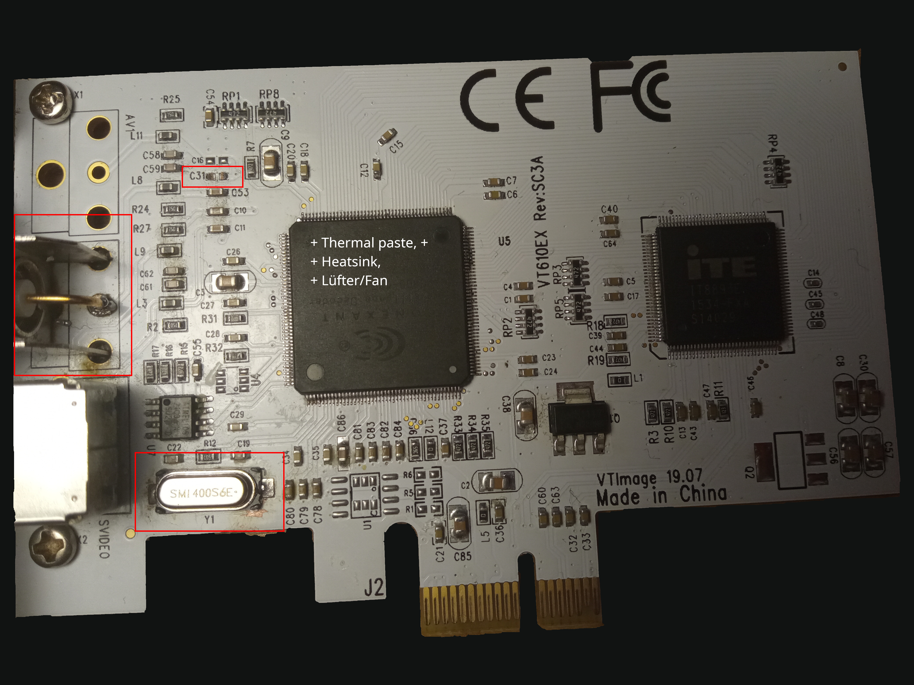
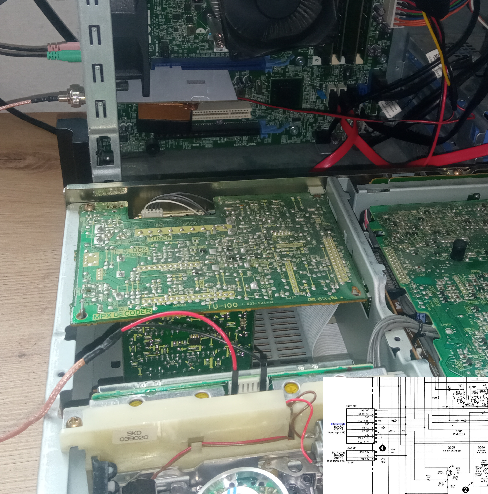
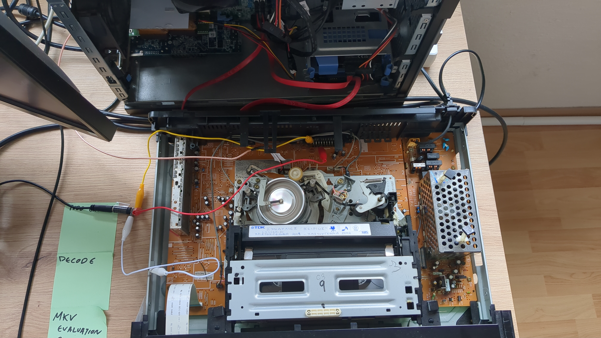

#+TITLE: rf-capture-cx23880-scripts-zsh
#+AUTHOR: Iason SK

* Description

This repo contains ZSH + bash scripts for RF capture (video8 and VHS) at 40MHz/40MSPS via the vhs-decode project for the follwing operations:

1. CX auto level calibration, zsh script
   #+begin_src     
source cx-calibrate.zsh
   #+end_src
2. FLAC RF capture, zsh script, set timeout in minutes. Check if tape 60/90 min and set accordingly.
   #+begin_src
# video8
zsh capture-rf-flac.zsh /path/to/capture-40msps-8bit-cx-card.flac 95 # hifi audio signal embedded into the single physical channel RF
# VHS     
zsh capture-rf-vhs-flac.zsh /path/to/capture-40msps-8bit-cx-card.flac 185 # requires edits for linear/analog audio capture (non RF/HIFI), I am using an external audio interface
   #+end_src
3. vhs-decode video + hifi + vhs-decode-auto-audio-align + tbc-video-export FFV1 video coding, MATROSKA containter, this is a bash script --> just execute
   #+begin_src
~/scripts/rf/decode-rf.sh /path/to/capture-40msps-8bit-cx-card.flac
   #+end_src

*Note:* This repo is for my personal use / archiving. Therefore adaption on paths and logic is required if your are attempting to reuse.

* HW dependencies
1. [[https://github.com/oyvindln/vhs-decode/wiki/CX-Cards#crystal-mod---5-25usd][Crystal mod 40MHz for 40msps 8-bit capture]]
2. [[https://github.com/oyvindln/vhs-decode/wiki/CX-Cards#cooling-mod][Cooling mod: Heatsink + Fan mod (At 40Mhz chip gets hot and frames are dropped. You've been warned!)]]
3. [[https://de.aliexpress.com/item/1005004394809131.html?aff_fcid=555eff6335ff442aab672b6fea2e7a3a-1752516809334-07431-_DBDAGXp&tt=CPS_NORMAL&aff_fsk=_DBDAGXp&aff_platform=shareComponent-detail&sk=_DBDAGXp&aff_trace_key=555eff6335ff442aab672b6fea2e7a3a-1752516809334-07431-_DBDAGXp&terminal_id=8468523680124c75945a6be79bae62d6&afSmartRedirect=y&gatewayAdapt=glo2deu][BNC auf DuPont-Kabel]]
4. [[https://github.com/oyvindln/vhs-decode/wiki/CX-Cards#c31-removal][Capacitor 31 removal]]
5. [[https://github.com/oyvindln/vhs-decode/wiki/CX-Cards#rca-to-bnc-replacement][RCA to BNC replacement]]
6. EV-S1000 or some other easily tap-able player (or not if you like adventure ;-) )
   

WARNING: For VHS capture it is expected that the audio is captured in the linear/analogue domain (Non RF/HIFI) via crocodile clips leading to the input of a sound card. The capture script requires editing for specifying the audio interface, or complete removal+addition of HIFI capture channel.

* Referencing projects used in the scripts

1. https://github.com/oyvindln/vhs-decode/
2. https://gitlab.com/wolfre/vhs-decode-auto-audio-align
3.  https://github.com/happycube/cxadc-linux3/
